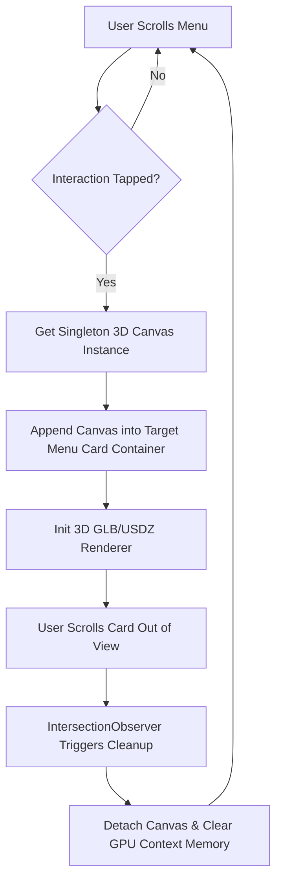
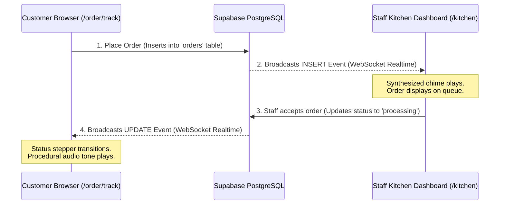

# Oasis Royale — 3D Interactive WebAR Dining

> A premium, mobile-first WebAR restaurant platform that lets customers project dishes directly onto their table in 3D, customize orders, and track preparation status in real-time.

*   **Live Web App**: [oasisroyale.vercel.app](https://oasisroyale.vercel.app/)
*   **Built With**: Next.js 15, Supabase (Database & Realtime WebSockets), Three.js, Google Model-Viewer, Web Audio API, TailwindCSS 4, Vercel

---

## ✨ Key Features & Capabilities

*   📱 **Interactive 3D Menu**: Guests browse high-fidelity 3D models of dishes directly in their mobile browser. Rotate, zoom, and inspect details seamlessly.
*   🕶️ **WebAR Placement**: View dishes in Augmented Reality projected onto real tables to preview sizes and plating before ordering.
*   ⚡ **Zero-Polling Real-Time Tracking**: Immediate order status syncing (from *Pending* to *Processing*, *Ready*, and *Completed*) powered by Supabase PostgreSQL replication.
*   🔔 **Dynamic Web Audio Chimes**: Live, procedural sound synthesis alerts counter and kitchen staff when new orders arrive, or notifies customers of status transitions.
*   👨‍🍳 **Staff Operations Suite**:
    *   **Counter Dashboard (`/counter`)**: Approves checkout, sets preparation ETAs, and processes payments.
    *   **Kitchen Panel (`/kitchen`)**: Tracks active cooking orders with priority timers and ready states.
    *   **Dispatch Board (`/dispatch`)**: Manages the pickup queue for served orders.

---

## 🛠️ Architecture & Technical Highlights

### 1. Zero-Crash 3D Singleton Canvas Reparenting
Mobile WebGL engines enforce strict memory budgets and can crash when initializing multiple `<model-viewer>` or Three.js contexts. Oasis Royale resolves this by maintaining **exactly one (1)** persistent renderer canvas in memory and dynamically reparenting it to the active card the user interacts with. An `IntersectionObserver` handles automatic detachment and memory cleanup.



### 2. Event-Driven Real-Time Synchronization
Instead of heavy API polling, the client establishes a Postgres changes WebSocket channel filtered by the active session ID.



---

## 📦 Core Technology Stack

| Technology | Purpose | Key Details |
| :--- | :--- | :--- |
| **Next.js 15 & React 19** | Application Framework | Fast Server-Side Rendering & App Router navigation |
| **Supabase SDK** | Backend-as-a-Service | Realtime WebSockets, database layer, and user authentication |
| **Three.js & Model-Viewer** | WebGL Rendering | Displays interactive 3D assets and enables AR projection |
| **Framer Motion & GSAP** | High-Performance Animations | Smooth page transitions and floating ambient embers |
| **Web Audio API** | Procedural Audio | Synthesizes alerts dynamically in-browser (zero asset load) |
| **TailwindCSS 4** | Styling | Modern, highly optimized, utility-first design system |

---

## 🚀 Local Setup & Installation

Follow these steps to run the project locally on your machine:

### 1. Clone & Install
```bash
git clone https://github.com/Huzaifa-Siddique/oasis-royale.git
cd oasis-royale
npm install --legacy-peer-deps
```

### 2. Configure Environment Variables
Create a `.env.local` file at the root of the project:
```env
NEXT_PUBLIC_SUPABASE_URL=https://your-project-id.supabase.co
NEXT_PUBLIC_SUPABASE_ANON_KEY=your-supabase-public-anon-key
SUPABASE_SERVICE_ROLE_KEY=your-supabase-service-role-key
```
*(Note: If no custom environment variables are provided, the app automatically falls back to a sandbox database configured in `src/lib/supabase.ts` for instant testing).*

### 3. Set Up Database Schema
If using your own Supabase instance, run the contents of [`supabase-schema.sql`](supabase-schema.sql) in your Supabase SQL Editor. This script creates the tables (`dishes`, `orders`, `profiles`, `staff`), establishes Row Level Security (RLS) policies, and enables database replication for real-time updates.

### 4. Run the Application
```bash
npm run dev
```
Open [http://localhost:3000](http://localhost:3000) to view it.

---

## 📦 Build & Optimization Tools

Optimize assets and compile the application:

*   **Draco GLB Compression**: Compress 3D models to keep payload sizes minimal:
    ```bash
    npm run compress
    ```
*   **USDZ Conversion**: Export models for iOS Quick Look support:
    ```bash
    npm run convert-usdz
    ```
*   **Production Build**: Compile and optimize the project:
    ```bash
    npm run build
    ```

---

## 📜 License
This project is licensed under the [MIT License](LICENSE).
