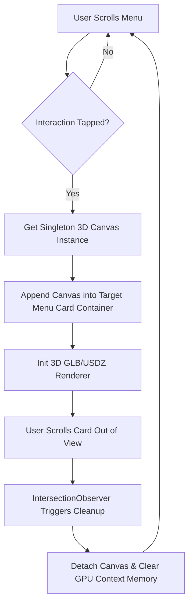
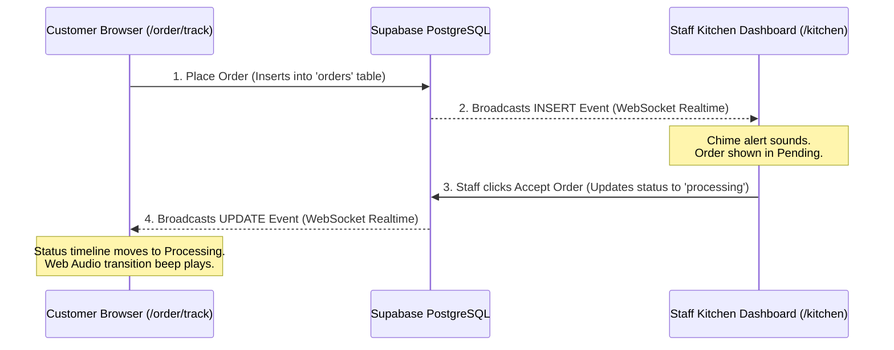

# 🍕 Oasis Royale — 3D Interactive WebAR Dining

> **A premium, mobile-first WebAR restaurant platform that lets customers project dishes directly onto their table in 3D, and tracks orders in real-time using Supabase WebSockets.**

🚀 **Live Production Site**: [oasisroyale.vercel.app](https://oasisroyale.vercel.app/)

---

## ⚡ 30-Second Reviewer Walkthrough (Demo the Real-Time Loop)

To see the real-time sync and Web Audio systems in action:

1. **Open Side-by-Side Windows**:
   * **Window A (Customer Menu)**: Open [`https://oasisroyale.vercel.app/menu`](https://oasisroyale.vercel.app/menu).
   * **Window B (Kitchen Panel)**: Open [`https://oasisroyale.vercel.app/kitchen`](https://oasisroyale.vercel.app/kitchen).
2. **Place an Order (Window A)**:
   * Click **"Tap to Interact"** on a dish card to load the 3D singleton model.
   * Add a dish to your cart, click checkout, fill in the details, and place the order.
   * You'll be redirected to the real-time tracking page (`/order/track`).
3. **Accept the Order (Window B)**:
   * Look at the Kitchen dashboard. You'll hear a **synthesized chime** and see the new order pop up in real-time.
   * Click **Accept Order** to set an ETA (e.g., 15 minutes).
4. **Watch Real-Time Status Updates (Window A)**:
   * Witness the tracking timeline transition from *Pending* to *Processing* instantly without page refresh, accompanied by status notification beeps!

---

## 💎 Key Reviewer Highlights

*   **Zero-Crash 3D Singleton Canvas**: Mobile browsers crash if you load multiple WebGL elements. Oasis Royale uses exactly **one (1)** persistent `<model-viewer>` instance in global memory. When a customer interacts with a card, the instance is dynamically reparented. An `IntersectionObserver` handles automatic memory cleanup.
*   **Native WebAR Preview**: Tap **"View in AR"** on iOS to launch **AR Quick Look** (pre-built `.usdz` assets), or on Android to launch **Google Scene Viewer** (`.glb` assets optimized using Draco compression to <1.2MB).
*   **Real-time Order Stepper**: Fully powered by **Supabase Postgres Change WebSockets**—order status updates sync instantly between the kitchen panel and the user tracker.
*   **Synthesized Web Audio System**: Uses the Web Audio API to synthesize custom chimes and notification tones dynamically, bypassing mobile browser media autoplay restrictions.

---

## 🏗️ Technical Architecture

### 1. Zero-Crash 3D Singleton Canvas Reparenting


### 2. Supabase Real-Time Order Stepper


---

## 🗺️ Project Core Routes

| Route | Role | Purpose |
| :--- | :--- | :--- |
| `/` | Landing / Entrance | Minimal luxury landing page with smooth motion animations. |
| `/menu` | Customer Menu | High-performance menu with interactive 3D WebAR models. |
| `/order` | Cart & Checkout | Order confirmation, customer details, and database submission. |
| `/order/track` | Live Tracker | Real-time WebSocket timeline indicating current status. |
| `/kitchen` | Kitchen Screen | Back-of-house panel to accept/manage orders and trigger status changes. |
| `/dispatch` | Delivery Screen | Delivery control panel to dispatch and complete orders. |
| `/admin` | Store Admin | Management hub for metrics, product visibility, and system health. |

---

## 📂 Project Organization

```
Oasis Royale/
├── src/
│   ├── app/                # Next.js App Router (Pages, API Route Handlers)
│   │   ├── admin/          # Admin Dashboard
│   │   ├── dispatch/       # Dispatch Panel
│   │   ├── kitchen/        # Kitchen order monitoring UI
│   │   ├── menu/           # High-Performance interactive 3D Menu
│   │   ├── order/          # Checkout page & `/order/track` realtime client
│   │   └── api/            # Supabase API handlers for dishes and orders
│   ├── components/         # Premium design components (Glassmorphism containers, buttons)
│   ├── hooks/              # Custom React Hooks (WebGL Reparenting, Audio Synthesis)
│   └── lib/                # Shared modules (Supabase, utilities, types)
├── public/                 # Static files
│   └── models/             # Optimized 3D model pipelines (.glb & .usdz format)
├── docs/                   # Internal specifications and specs
│   └── development/        # Session memories & developmental logs
├── migrations/             # Supabase Schema Migration scripts
├── scripts/                # Asset pipelines (scripts to compress and convert GLB models)
├── supabase-schema.sql     # Database seeding SQL file
├── package.json            # Dependencies & Scripts definition
└── netlify.toml            # Netlify configuration (Legacy)
```

---

## 🚀 Local Installation & Configuration

Follow these 4 steps to get the environment working locally:

### 1. Clone the repository
```bash
git clone https://github.com/Huzaifa-Siddique/oasis-royale.git
cd oasis-royale
```

### 2. Configure Environment Variables
Create a `.env.local` file at the root of the project:
```env
NEXT_PUBLIC_SUPABASE_URL=https://your-project-id.supabase.co
NEXT_PUBLIC_SUPABASE_ANON_KEY=your-supabase-public-anon-key
SUPABASE_SERVICE_ROLE_KEY=your-supabase-service-role-key
```

### 3. Initialize the Supabase Database
1. Go to your **Supabase Project Dashboard** and open the **SQL Editor**.
2. Copy the contents of [`supabase-schema.sql`](file:///D:/HUZAIFA/Oasis%20Royale/agents-netlify-supabase-env-fix/supabase-schema.sql) and run the script. This will set up all required tables, Row-Level Security, and replication for real-time WebSockets.

### 4. Install Dependencies & Launch
```bash
npm install --legacy-peer-deps
npm run dev
```
Open [http://localhost:3000](http://localhost:3000) to view the application locally.

---

## 📦 Build-Time Compression & USDZ Pipeline

The repository includes build-time tools inside `package.json` to optimize complex 3D assets to keep the bundle footprint below 1.2MB per dish:

* **Draco GLB Compression**:
  ```bash
  npm run compress
  ```
  Compresses textures and reduces polycount without loss of visual details.
* **Apple Quick Look USDZ Export**:
  ```bash
  npm run convert-usdz
  ```
  Generates Apple-compliant USDZ models with fully unlit textures optimized for iOS AR Quick Look lighting.

---

## 🛠️ Technologies Used

[](https://nextjs.org/)
[](https://supabase.com/)
[](https://tailwindcss.com/)
[](https://vercel.com/)
[](https://threejs.org/)

---

## 📜 License
Licensed under the [MIT License](LICENSE).
