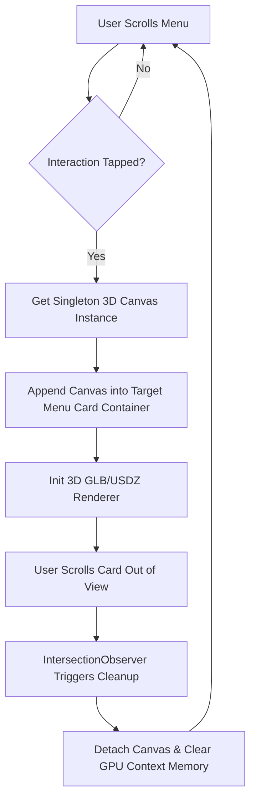
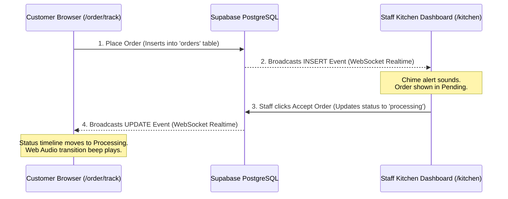

# 🍕 Oasis Royale — 3D Interactive WebAR Dining

> **A premium, mobile-first WebAR restaurant platform that lets customers project dishes directly onto their table in 3D, and tracks orders in real-time using Supabase WebSockets.**

* **Live Web App**: [oasisroyale.vercel.app](https://oasisroyale.vercel.app/)
* **Technologies**: Next.js 15, Supabase Database & Realtime, WebGL (Three.js + Google Model Viewer), Web Audio API, TailwindCSS 4, Vercel

---

## 📸 User Interface Showcase

| 📱 3D Interactive Menu | ⏳ Real-Time Order Tracker | 👨‍🍳 Kitchen Control Dashboard |
| :---: | :---: | :---: |
|  |  |  |

*(Note: To display UI previews, save your screenshots inside the `public/` directory as `menu-preview.png`, `tracker-preview.png`, and `kitchen-preview.png` respectively).*

---

## ⚡ 30-Second Quick Start (Demo the Real-Time Loop)

To see the real-time order state engine and Web Audio notification system in action:

1. **Open Side-by-Side Windows**:
   * **Window A (Customer Menu)**: Open the [Customer Menu](https://oasisroyale.vercel.app/menu).
   * **Window B (Counter Panel)**: Open the [Counter Dashboard](https://oasisroyale.vercel.app/counter).
   * **Window C (Kitchen Panel)**: Open the [Kitchen Dashboard](https://oasisroyale.vercel.app/kitchen).
2. **Place an Order (Window A)**:
   * Tap a menu card to load the 3D model, add a dish to the cart, and complete checkout.
   * You'll be redirected to the real-time tracking page (`/order/track`) in `pending` status.
3. **Approve Payment (Window B - Counter)**:
   * Log in with your staff account. Approve the order to transition it to `processing` and set a preparation ETA.
4. **Prepare Order (Window C - Kitchen)**:
   * Log in with your staff account. The kitchen will hear a synthesized chime and see the order. Click **Ready** when cooked to transition the status to `ready`.
5. **Watch Real-Time Status Updates (Window A)**:
   * Witness the tracking timeline transition from *Pending* to *Processing* and then *Ready* instantly without page refresh, accompanied by Web Audio notification tones!

---

## 🔐 Staff & Admin Access

Authentication is powered by **Supabase Auth**. Since this is a public repository, credentials are kept secure and are not hardcoded. 

* **Live Testing**: The credentials for the Staff accounts (used to access `/counter`, `/kitchen`, and `/dispatch`) are provided privately in the **submission notes** of the portal.
* **Local Development**: If you are hosting your own fork of this project, you can register a new account on [`/profile`](https://oasisroyale.vercel.app/profile) and promote their role by running:
  ```sql
  UPDATE profiles SET role = 'staff' WHERE email = 'your-email@example.com';
  ```

---

## 🏗️ Technical Architecture

### 1. Zero-Crash 3D Singleton Canvas Reparenting
Mobile WebGL engines enforce strict memory budgets (often crashing when loading multiple `<model-viewer>` or Three.js instances). Oasis Royale solves this by keeping **exactly one (1)** persistent renderer context in global memory, reparenting it dynamically to target cards as the user interacts. An `IntersectionObserver` handles automatic detachment and cleanup.



### 2. Supabase Real-Time Order Stepper
Instead of polling, the client opens a Postgres change WebSocket subscription filtering specifically by the current session ID to track the status path.



---

## 📦 Core Dependencies & Components

| Dependency | Purpose |
| :--- | :--- |
| **Next.js 15** | Framework for routing, server API handlers, and deployment. |
| **Supabase SDK** | Handles user authentication and PostgreSQL WebSocket replication. |
| **Three.js & Google Model Viewer** | Custom WebGL container rendering interactive 3D structures. |
| **Framer Motion & GSAP** | High-performance, hardware-accelerated animations. |
| **Web Audio API** | Synthesizes status alerts dynamically without relying on static files. |

---

## 🚀 Local Setup & Installation

Get the project running on your local machine in 3 simple steps:

### 1. Clone the repository
```bash
git clone https://github.com/Huzaifa-Siddique/oasis-royale.git
cd oasis-royale
```

### 2. Configure Environment Variables
Create a `.env.local` file at the root of the project:
```env
NEXT_PUBLIC_SUPABASE_URL=https://your-project-id.supabase.co
NEXT_PUBLIC_SUPABASE_ANON_KEY=your-supabase-public-anon-key
SUPABASE_SERVICE_ROLE_KEY=your-supabase-service-role-key
```
*(Note: If no environment variables are defined, the app automatically falls back to a sandbox database configured in `src/lib/supabase.ts` for out-of-the-box testing).*

### 3. Initialize the Supabase Database (Optional)
If setting up your own Supabase instance:
1. Go to your **Supabase Dashboard SQL Editor**.
2. Run the script inside [`supabase-schema.sql`](supabase-schema.sql) to create the tables (`dishes`, `orders`, `profiles`, `staff`), establish RLS policies, and enable real-time replication.

### 4. Install Dependencies & Launch
```bash
npm install --legacy-peer-deps
npm run dev
```
Open [http://localhost:3000](http://localhost:3000) to view the application locally.

---

## 📦 Build-Time 3D Compression

Optimize 3D models to keep sizes below 1.2MB:
* **Draco GLB Compression**: `npm run compress`
* **Apple Quick Look USDZ Export**: `npm run convert-usdz`

---

## 📜 License
Licensed under the [MIT License](LICENSE).
