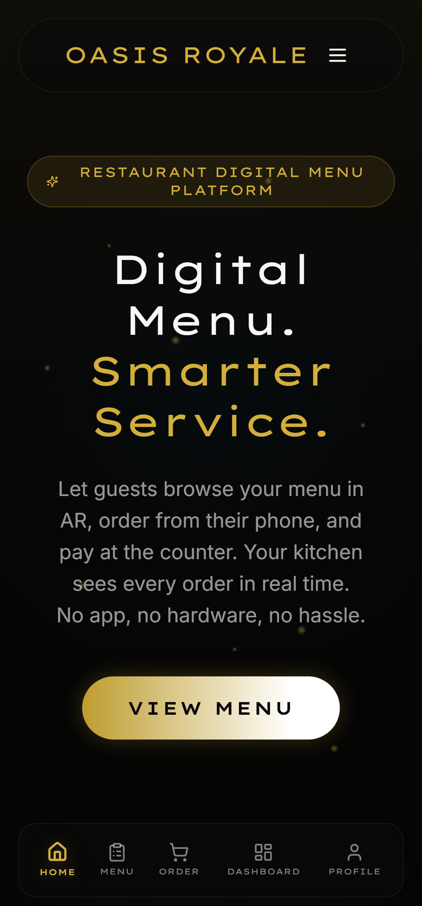
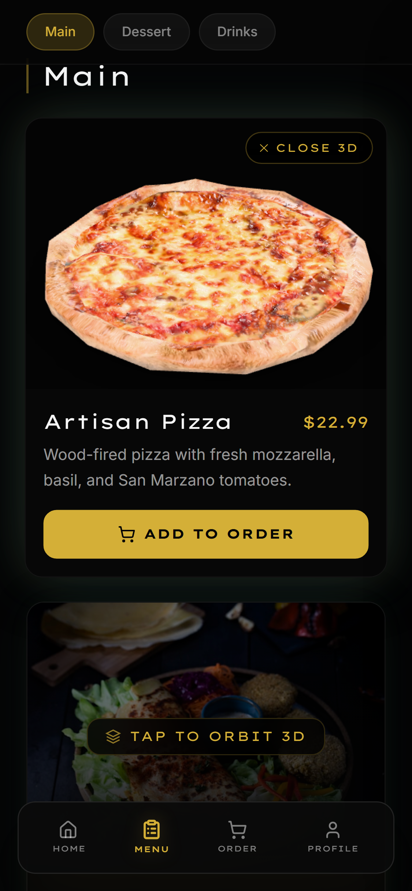
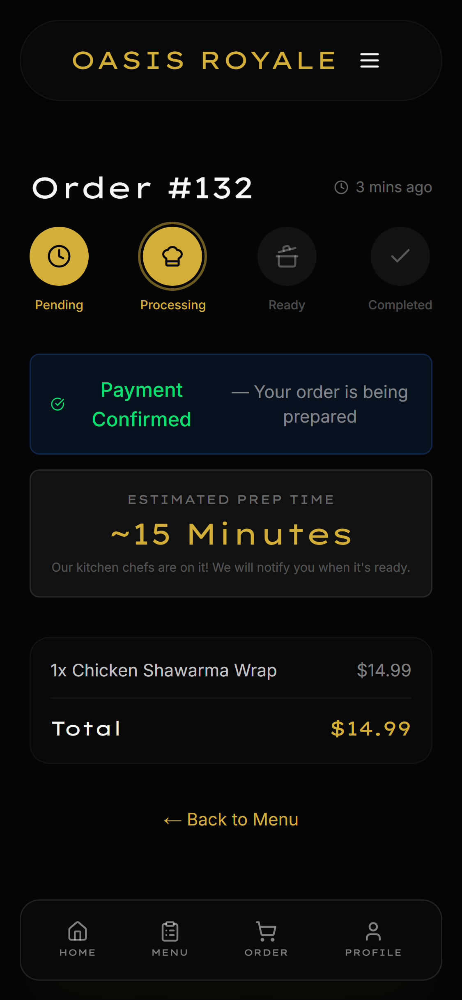
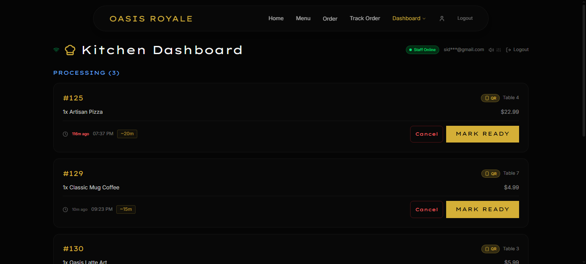
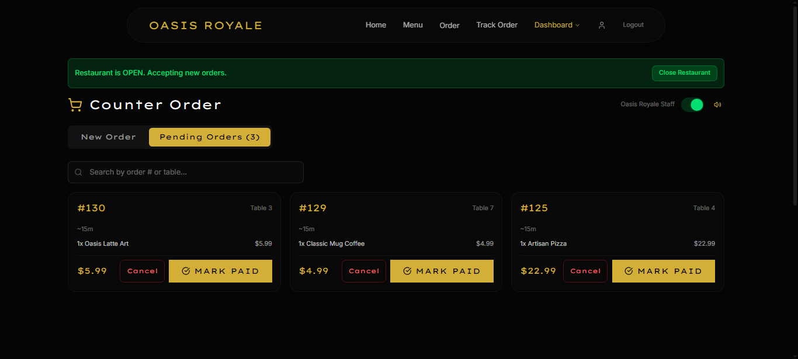
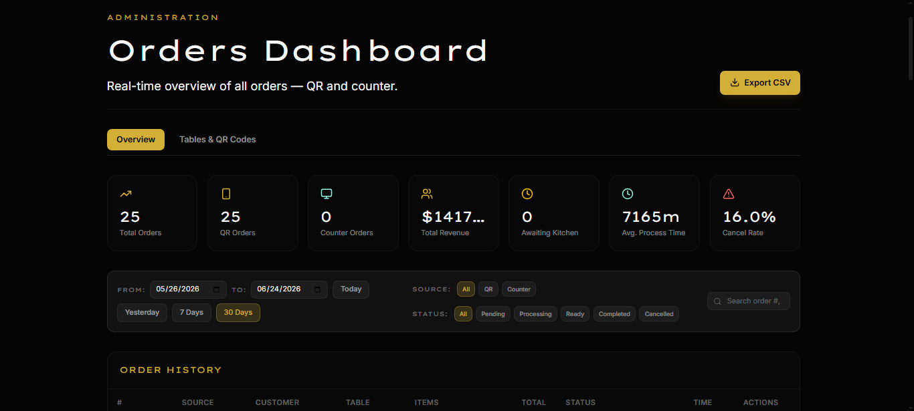
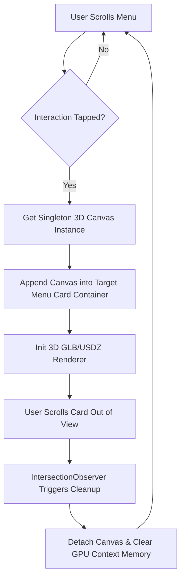
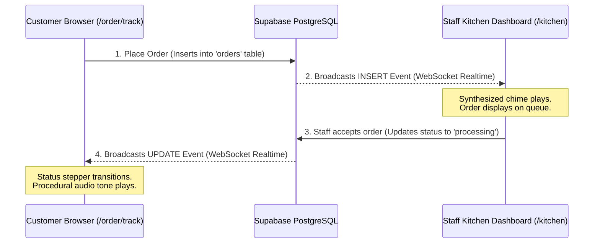

# Oasis Royale

An interactive 3D WebAR menu and real-time ordering platform for mobile-first dining.

Customers scan a QR code at their table, preview food in 3D or place it directly in front of them in the real world using WebAR, add items to their cart, and track their preparation timeline in real-time.

*   **Live Web App**: [oasisroyale.vercel.app](https://oasisroyale.vercel.app/)
*   **Built With**: Next.js 15, Supabase (Database & Realtime WebSockets), Three.js, Google Model-Viewer, Web Audio API, TailwindCSS 4, Vercel

---

## 📸 Screenshots

To display screenshots of the application on GitHub, take screenshots of your pages in mobile view and save them inside the `public/screenshots/` folder matching these filenames:

| 📱 Customer Homepage | 🍔 Interactive 3D & AR Menu | ⏳ Real-Time Tracker |
| :---: | :---: | :---: |
|  |  |  |

| 👨‍🍳 Kitchen Queue Dashboard | 💰 Counter Checkout Panel | 📊 Admin Analytics Panel |
| :---: | :---: | :---: |
|  |  |  |

---

## What it does

*   **3D Orbit Viewer**: Guests can touch-drag to orbit the 3D models, pinch to zoom, and inspect dish details and textures from any angle in real-time.
*   **"View in your space" WebAR**: A button that projects the 3D models onto physical tables using Google Scene Viewer (Android) or Quick Look (iOS) with actual real-world dimensions to preview plating and sizes before ordering.
*   **Live Order Sync**: No page refreshes. The order tracking screen (`/order/track`) receives instant status updates (Pending, Processing, Ready) from the kitchen via Supabase realtime WebSockets.
*   **Admin Analytics Dashboard (`/admin/dashboard`)**: A private portal for owners showing real-time sales statistics, table activity heatmaps, checkout source distribution (QR vs Counter), QR code generation for physical tables, and order cancellation wastage tracking.
*   **Counter Panel (`/counter`)**: Used by counter staff to approve cart checkout, set preparation ETAs, process payments, and track order metrics.
*   **Kitchen Panel (`/kitchen`)**: A real-time cooking display board for chefs, featuring visual timers and order state transition actions.
*   **Dispatch Board (`/dispatch`)**: A dedicated pickup screen for served orders.
*   **Procedural Alerts**: Dynamic audio chimes are synthesized on the fly using the Web Audio API to alert kitchen staff of new orders and notify customers of status changes without loading audio files.

---

## Engineering Details & Challenges

### 1. Canvas Reparenting (WebGL Memory Optimization)
Mobile browsers have strict WebGL memory budgets and will crash if you try to render multiple 3D models at once. To solve this, Oasis Royale creates exactly one (1) persistent `<model-viewer>` renderer context in global memory. 

When a user interacts with a menu card, the singleton canvas is reparented into that specific card. An `IntersectionObserver` detects when cards scroll out of view, automatically detaching the canvas and freeing GPU memory.



### 2. WebSocket Real-Time Synchronization
Instead of polling the API every few seconds to check if their order is ready, the client subscribes to a Postgres changes WebSocket channel filtered by the active session ID.



---

## Tech Stack

*   **Framework**: Next.js 15 (App Router), React 19
*   **Styles & Animations**: TailwindCSS 4, Framer Motion, GSAP, Lenis
*   **WebGL & AR**: Three.js, Google Model-Viewer
*   **Backend & DB**: Supabase (Database, Auth, and Realtime replication)
*   **Sound**: Web Audio API (synthesized chime alerts)

---

## Local Setup

To run this project on your machine:

### 1. Clone & Install
```bash
git clone https://github.com/Huzaifa-Siddique/oasis-royale.git
cd oasis-royale
npm install --legacy-peer-deps
```

### 2. Set Up Environment Variables
Create a `.env.local` file at the root:
```env
NEXT_PUBLIC_SUPABASE_URL=https://your-project-id.supabase.co
NEXT_PUBLIC_SUPABASE_ANON_KEY=your-supabase-public-anon-key
SUPABASE_SERVICE_ROLE_KEY=your-supabase-service-role-key
```
*(Note: If no custom environment variables are provided, the app automatically falls back to a sandbox database for immediate testing).*

### 3. Database Schema
If you're using your own Supabase instance, copy and run the SQL code inside [`supabase-schema.sql`](supabase-schema.sql) in your Supabase SQL Editor. This will create the required tables (`dishes`, `orders`, `profiles`, `staff`) and set up the replication policies for real-time updates.

### 4. Run the Dev Server
```bash
npm run dev
```
Open [http://localhost:3000](http://localhost:3000) to view the app locally.

---

## Model Pipeline & Build Tools

*   **Draco GLB Compression**: Compress 3D models to reduce file size:
    ```bash
    npm run compress
    ```
*   **USDZ Export**: Convert models for Apple Quick Look support:
    ```bash
    npm run convert-usdz
    ```
*   **Production Build**: Compile and optimize the project:
    ```bash
    npm run build
    ```

---

## License
Licensed under the [MIT License](LICENSE).
